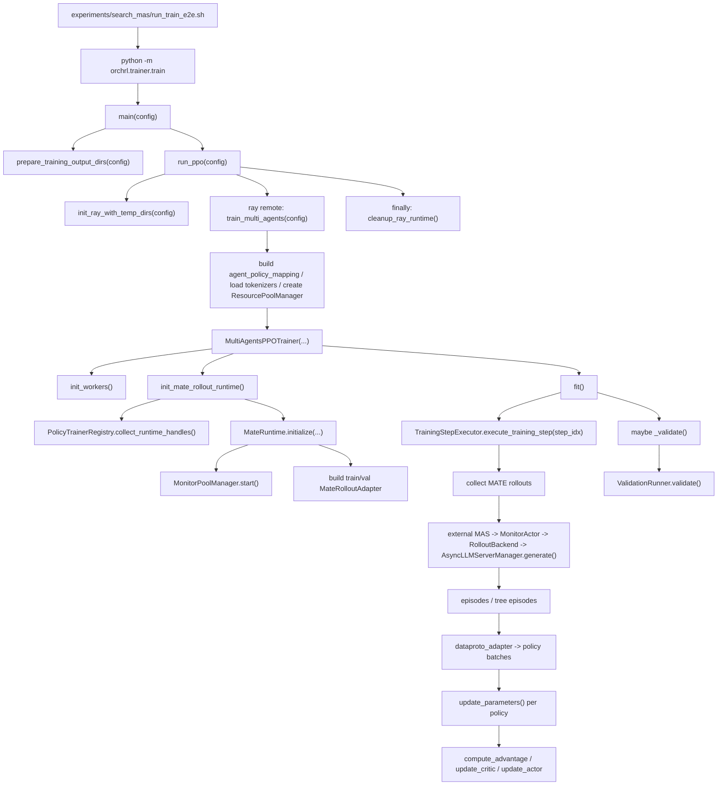
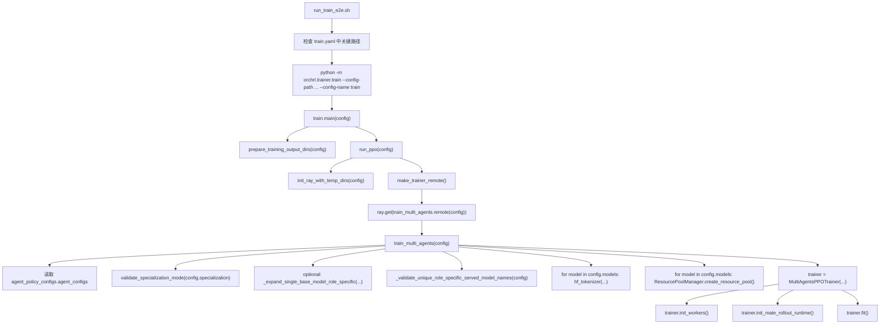
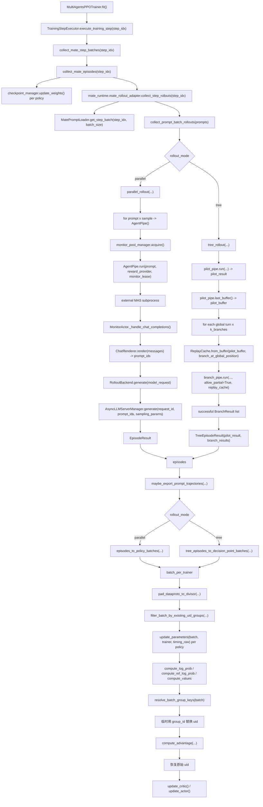
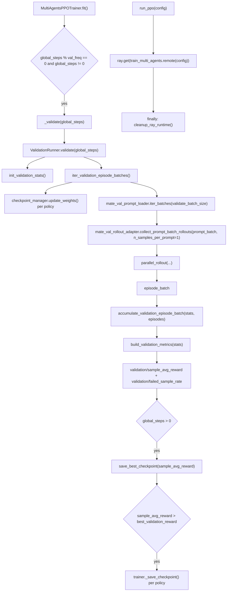

# OrchRL 当前训练流程说明

本文档以当前仓库代码为唯一基线，描述当前可直接运行的 Search MAS 端到端训练链路，并重点解释 OrchRL 如何以相对非侵入的方式，对外部黑盒 MAS 系统进行 RL 训练。

本文档对应的主要代码入口如下：

- 训练启动脚本：`experiments/search_mas/run_train_e2e.sh`
- 主训练配置：`experiments/search_mas/train.yaml`
- Search MAS 模板配置：`mas_apps/search/configs/inference.yaml`
- Python 入口：`orchrl/trainer/train.py`
- 总训练器：`orchrl/trainer/multi_agents_ppo_trainer.py`
- 外部 MAS 应用：`mas_apps/search`
- MATE 运行时：`orchrl/trainer/mate/runtime.py`
- rollout 适配：`orchrl/trainer/mate/rollout_adapter.py`
- monitor 与轨迹引擎：`orchrl/agent_trajectory_engine/`

## 1. 一句话概括当前链路

当前 Search MAS 训练不是把 prompt 直接交给单个 PPO rollout server 采样，而是走下面这条桥接链路：

1. Shell 脚本加载 Hydra 配置并做基础检查。
2. `orchrl.trainer.train` 初始化 Ray、构建多个 `RayPPOTrainer`。
3. `MultiAgentsPPOTrainer` 再初始化一套 MATE 运行时。
4. 每个训练 step 会把 prompt 交给外部 MAS 子进程执行。
5. MAS 内部各 agent 的 LLM 请求会打到 `MonitorActor` 暴露的 OpenAI 风格接口。
6. `MonitorActor` 把对话消息重渲染为 prompt ids，再通过 `RolloutBackend` 路由到对应 policy 的 VERL 推理服务。
7. monitor 缓冲区里的 turn 记录被整理为轨迹、计算 reward、再转换成按 policy 划分的 `DataProto`。
8. 每个 policy 再走各自的 PPO 更新流程。

这条路径的关键价值在于：外部 MAS 仍然以“独立应用”的方式存在，OrchRL 不需要把其业务逻辑重写进 trainer，只需要接管其模型请求入口与轨迹回收。

### 1.1 方法调用总览图

下面几张图只画训练主干方法调用，不展开所有内部 helper。阅读顺序建议是：先看总览，再按启动、初始化、单步训练、验证与清理逐张看细节。



### 1.2 启动链路图



### 1.3 运行时初始化图

```mermaid
flowchart TD
    A["MultiAgentsPPOTrainer.__init__"] --> B["PolicyTrainerRegistry(...)"]
    A --> C["MateRuntime(config.training.mate, agent_policy_mapping)"]
    A --> D["ValidationRunner(...)"]
    A --> E["TrainingStepExecutor(...)"]
    A --> F["_initialize_ppo_trainers()"]
    F --> G["PolicyTrainerRegistry.initialize_ppo_trainers()"]
    G --> H["create_single_ppo_trainer() or create_multiple_ppo_trainers()"]

    I["MultiAgentsPPOTrainer.init_workers()"] --> J["PolicyTrainerRegistry.init_workers()"]
    J --> K["RayPPOTrainer.init_workers() per policy"]

    L["MultiAgentsPPOTrainer.init_mate_rollout_runtime()"] --> M["PolicyTrainerRegistry.collect_runtime_handles()"]
    M --> N["checkpoint_manager_dict / server_handle_dict / policy_server_name_mapping"]
    L --> O["MateRuntime.initialize(tokenizer_dict, server_handle_dict, policy_server_name_mapping)"]
    O --> P["_build_mate_monitor_pool_manager()"]
    P --> Q["for role -> ChatRenderer.from_tokenizer(...)"]
    P --> R["for policy -> AsyncLLMServerManager(manager_config, server_handles)"]
    P --> S["RolloutBackend(policy_to_manager, policy_to_tokenizer, policy_to_actual_model)"]
    P --> T["MonitorPoolManager(backend, model_mapping, renderer)"]
    O --> U["monitor_pool_manager.start()"]
    O --> V["_init_mate_rollout_adapter()"]
    V --> W["MatePromptLoader(train_data_path)"]
    V --> X["MatePromptLoader(val_data_path)"]
    V --> Y["build_reward_provider(...)"]
    V --> Z["MateRolloutAdapter(train tree/parallel config)"]
    V --> AA["MateRolloutAdapter(validation config: parallel, n_samples_per_prompt=1)"]
```



### 1.4 采样与单步训练图



### 1.5 Validation、保存与清理图



## 2. 当前默认实验配置

以 `experiments/search_mas/train.yaml` 为准，当前默认 Search MAS 实验的关键配置如下：

### 2.1 训练拓扑

- `workflow_type: external_mas`
- `specialization: role_specific`
- agent roles：`verifier`、`searcher`、`answerer`
- `training.total_training_steps: 100`
- `training.train_batch_size: 2`
- `training.validate_batch_size: 10`
- `training.val_freq: 5`

当前仓库只保留两种 specialization：

- `role_sharing`：多个 role 共享一个 policy，只训练一个 policy
- `role_specific`：每个 role 对应自己的 policy，训练多个 policy

当前 Search MAS 默认使用 `role_specific`，因此会创建三个 policy trainer：

- `verifier_model`
- `searcher_model`
- `answerer_model`

### 2.2 模型与资源

- `resource.n_gpus_per_node: 6`
- 当前 `models` 数量：3
- 因此 `train_multi_agents()` 中会计算出 `n_gpus_per_model = 6 // 3 = 2`
- 每个 policy 对应一套独立的 `RayPPOTrainer` 与一组 rollout/critic/ref worker

当前配置中三个 base model 的有效路径都是：

- `/data1/lll/models/Qwen3-0.6B`

每个 model 的服务名分别配置为：

- `verifier_model`
- `searcher_model`
- `answerer_model`

这三个服务名会被用于 monitor 路由与推理服务区分。

### 2.3 数据与输出

当前训练数据相关配置：

- `training.data_root_dir: /data1/zzh/mas_app/search/data/drmas_search_mas`
- `training.train_data_path: ${training.data_root_dir}/train.parquet`
- `training.val_data_path: ${training.data_root_dir}/test_sampled.parquet`

当前 `train.yaml` 中也保留了完整验证集路径示例：

- `# val_data_path: ${training.data_root_dir}/test.parquet`

当前输出目录布局：

- `training.output_root_dir: outputs/training_runs`
- `training.run_dir: outputs/training_runs/<run_name>/<run_id>`
- `training.model_checkpoints_dir: outputs/training_runs/<run_name>/<run_id>/checkpoints`
- `training.mate.trajectory_export.output_dir: outputs/training_runs/<run_name>/<run_id>/trajectories`
- `training.mate.mas_log_dir: outputs/training_runs/<run_name>/<run_id>/mas_logs`

对应的仓库级输出位置可以直接理解为：

- `outputs/training_runs/<experiment_name>/<run_id>/checkpoints`
- `outputs/training_runs/<experiment_name>/<run_id>/trajectories`
- `outputs/logs/`

`train.py` 在真正启动训练前，会通过 `prepare_training_output_dirs()` 自动创建这些目录。

## 3. 从 Shell 到 trainer 的启动链路

### 3.1 `run_train_e2e.sh`

`experiments/search_mas/run_train_e2e.sh` 的职责不是承载训练逻辑，而是做启动前编排：

1. 解析配置名与日志路径。
2. 读取 `train.yaml` 中的关键路径。
3. 检查 MAS 工作目录、配置模板、数据集、模型路径是否存在。
4. 设置运行环境变量。
5. 执行 `python3 -m orchrl.trainer.train --config-path ... --config-name train`。

这里读取训练/验证数据路径时，使用的是 `cfg.training.train_data_path` 和 `cfg.training.val_data_path`，不是 `cfg.training.mate.prompt_loader.path`。

因此它本质上是 fail-fast 启动脚本。

### 3.2 `orchrl/trainer/train.py`

`train.py` 是当前 Python 主入口。

主流程如下：

1. `main(config)` 调 `prepare_training_output_dirs(config)` 创建输出目录。
2. `run_ppo(config)` 初始化 Ray。
3. 通过一个远程 Ray task 执行 `train_multi_agents(config)`。
4. 在 `finally` 中调用 `cleanup_ray_runtime()`，确保训练结束后清理 Ray 运行时资源。

### 3.3 `train_multi_agents(config)`

这个函数负责把高层配置落成真正的训练器实例，主要做下面几件事：

1. 读取 `config.agent_policy_configs.agent_configs`，构建 `agent_policy_mapping`。
2. 校验 `base_models` 与 `models` 数量关系。
3. 校验 specialization 是否合法。
4. 在特殊情况下调用 `_expand_single_base_model_role_specific()`。
5. 校验各 policy 的 served model name 唯一。
6. 为每个 model 加载 tokenizer。
7. 为每个 model 创建 `ResourcePoolManager`。
8. 构造 `MultiAgentsPPOTrainer`，再依次执行：
   - `trainer.init_workers()`
   - `trainer.init_mate_rollout_runtime()`
   - `trainer.fit()`

需要注意几点：

- 当前代码只加载 tokenizer，不再加载 processor。
- `role_specific` 下如果配置里只给了一个 `base_model` 和一个 `model`，但存在多个 agent，代码会自动复制出多份 model 配置，使其与 agent-policy 映射对齐。
- `_validate_unique_role_specific_served_model_names()` 会确保不同 policy 的推理服务名不冲突，否则 monitor 无法正确路由。
- 在当前 external MAS 主链路里，`agent_policy_configs` 中真正参与 trainer 初始化的核心字段是 `name` 和 `policy_name`；`train_llm_config` / `val_llm_config` 并不直接驱动 MATE rollout 的采样参数。

## 4. `MultiAgentsPPOTrainer` 的职责边界

当前 `MultiAgentsPPOTrainer` 已经不是一个把所有逻辑揉在一起的大类，而是一个总编排器。它内部把职责拆给了几个明确的协作者：

- `PolicyTrainerRegistry`
- `MateRuntime`
- `TrainingStepExecutor`
- `ValidationRunner`

### 4.1 `PolicyTrainerRegistry`

职责：

- 根据 specialization 创建一个或多个 `RayPPOTrainer`
- 初始化各 trainer 的 worker
- 收集各 trainer 的运行时句柄

它会维护以下关键对象：

- `ppo_trainer_dict`
- `checkpoint_manager_dict`
- `async_rollout_manager_dict`
- `server_handle_dict`
- `policy_server_name_mapping`

其中最关键的是 `server_handle_dict` 和 `policy_server_name_mapping`，后续 monitor 路由会直接依赖它们。

### 4.2 `MateRuntime`

职责：

- 校验并标准化 `training.mate` 配置
- 启动 monitor pool
- 创建 train/val prompt loader
- 加载 reward provider
- 创建 train rollout adapter 与 val rollout adapter

这里有两个重要事实：

1. 当前 validation 不复用训练时的 tree 采样语义，`MateRuntime` 会强制构建一个 validation 专用 rollout adapter，并把：
   - `rollout_mode` 改成 `parallel`
   - `n_samples_per_prompt` 改成 `1`
2. prompt loader 的数据路径实际来自：
   - `training.train_data_path`
   - `training.val_data_path`

也就是说，`training.mate.prompt_loader` 主要提供的是：

- `source_type`
- `prompt_keys`
- `expected_keys`
- `train_repeat`
- `train_shuffle`
- `train_seed`

而不是最终的数据文件路径来源。

另外，`MateRuntime` 会把训练集 loader 配成可重复、可打乱的 train-only 采样器；验证集 loader 则固定为不 repeat、不 shuffle 的全量遍历。

这里还有两组直接影响训练语义的显式配置：

- `match_mode`
- `failure_policy`

### 4.3 `TrainingStepExecutor`

职责：

- 每步训练前更新各 policy 的 rollout 权重
- 通过 MATE rollout 收集轨迹
- 把轨迹转换成按 policy 划分的训练 batch
- 对每个 policy 执行 PPO 更新

它是“单步训练逻辑”的真正执行者。

### 4.4 `ValidationRunner`

职责：

- 遍历整个验证集
- 逐批执行 validation rollout
- 累积样本级 reward 和平均值
- 在 reward 更优时保存 best checkpoint

它负责的是“验证语义”，不是训练主循环本身。

## 5. MATE 运行时如何桥接外部黑盒 MAS

这是当前仓库最核心的工程设计。

### 5.1 外部 MAS 仍然是独立应用

当前 Search MAS 仍然保存在：

- `mas_apps/search`

训练时，OrchRL 并不会把这个应用“内嵌”为 trainer 内部模块，而是通过：

- `training.mate.mas_work_dir`
- `training.mate.mas_command_template`
- `training.mate.config_template_path`

把它作为一个外部子进程来运行。

当前默认命令模板是：

```bash
python scripts/run_search_mas.py --config {config_path} --question {prompt}
```

当前默认模板配置文件是：

- `mas_apps/search/configs/inference.yaml`

这意味着 OrchRL 与 MAS 的耦合面主要只有三类：

- 运行目录
- 启动命令模板
- 配置模板

这就是“相对非侵入训练黑盒 MAS”的核心工程基础。

当前 MAS 子进程的 stdout/stderr 不再直接丢弃，而是会按 episode 持久化到 `training.mate.mas_log_dir`，失败轨迹也能回溯到对应日志文件。

### 5.2 `MateRolloutAdapter` 如何发起 rollout

`MateRolloutAdapter` 的输入是：

- prompt loader
- reward provider
- role-policy 映射
- policy-server 映射
- monitor pool manager

它先把当前 step 对应的 prompt 切成 job，然后根据配置选择：

- `tree_rollout`
- `parallel_rollout`

训练路径当前默认是：

- `training.mate.rollout_mode: parallel`

验证路径则被强制改成：

- `parallel`

不管走哪种模式，`MateRolloutAdapter.collect_prompt_batch_rollouts()` 都会先把输入 prompt 展开成 job 列表。每个 job 至少包含：

- `prompt_item`
- `prompt_group_id`
- `sample_idx`

然后用 `max_concurrent_episodes` 控制同时有多少个 prompt 级 job 在跑。

如果 `n_samples_per_prompt > 1`，同一个 prompt 会先被展开成多个 job；也就是说，“每个 prompt 采几条样本”这件事是在 rollout adapter 层先完成 job 展开，再交给底层 rollout 函数执行。

### 5.3 `parallel_rollout` 如何做并行采样

`parallel_rollout` 的语义是：对一批 prompt，独立采样若干条 episode，不做树形分叉。

它的执行方式可以概括为：

1. 对输入的每个 prompt，按 `n_samples_per_prompt` 复制出多个采样任务。
2. 每个采样任务都会创建一个新的 `AgentPipe`。
3. 每个 `AgentPipe` 在运行前先向 `MonitorPoolManager` 申请一个 monitor lease。
4. 拿到 lease 后，启动外部 MAS 子进程，完整跑完一条 episode。
5. 任务结束后释放 monitor lease。
6. 最终把所有成功 episode 汇总成 `list[EpisodeResult]` 返回。

因此 parallel 模式的并行粒度是“完整 episode 级并行”，不同样本之间彼此独立，不共享 replay 前缀，也不存在 branch-point 概念。

### 5.4 `tree_rollout` 如何做分支采样

`tree_rollout` 的语义不是“每个 prompt 直接并行采 k 条完整轨迹”，而是先跑一条 pilot，再围绕 pilot 的每个全局 turn 做分支扩展。

当前执行顺序如下：

1. 先创建一个 `pilot_pipe`，完整跑出一条 pilot episode。
2. 从 pilot 的 monitor buffer 中取出按时间排序后的所有 turn，形成 `pilot_buffer`。
3. 把 pilot 中每个全局 turn 位置都视为一个潜在分叉点。
4. 对每个分叉点，重复采样 `k_branches` 次。
5. 每条 branch 在启动前，先根据 pilot buffer 构造一个 `ReplayCache`。
6. branch episode 运行时，会把分叉点之前的前缀 turn 直接复用，只在 branch-point 及之后重新生成。
7. branch 采样完成后，只保留成功 branch。

因此 tree 模式的真实采样语义是：

- 先有 1 条完整 pilot
- 再对 pilot 的每个全局 turn 位置扩出若干 branch

而不是“k 条彼此完全独立的完整 episode”。

并发控制上也分两层：

- `max_concurrent_episodes` 控制同时有多少个 prompt job 在跑
- `tree.max_concurrent_branches` 控制单个 prompt 的 branch 扩展时，同时最多跑多少条 branch

### 5.5 `AgentPipe` 如何真正运行 MAS

`AgentPipe.run()` 的真实流程是：

1. 从 monitor pool 申请一个 `MonitorLease`
2. 根据配置模板生成一份临时 MAS 配置
3. 把 monitor URL 注入到配置里
4. 以子进程方式启动外部 MAS
5. 等待 MAS 执行结束
6. 从对应 `MonitorActor` 拉取缓冲区中的 turn 记录
7. 用 `TrajectoryCollector` 组装轨迹
8. 用 `RewardWorker` 调 reward provider 计算 reward
9. 返回 `EpisodeResult`

因此，训练真正依赖的不是 MAS 子进程 stdout，而是 monitor 记录下来的 LLM 交互轨迹。

### 5.6 `MonitorActor` 如何接管 MAS 的模型请求

`MonitorActor` 会暴露一个 OpenAI 风格接口：

- `/leases/{lease_id}/v1/chat/completions`

外部 MAS 在运行时把 agent 的模型请求打到这里。随后 `MonitorActor` 会：

1. 校验当前请求属于哪个 agent role。
2. 根据 role 找到其映射的实际 served model name。
3. 用 `ChatRenderer` 把消息重渲染为 prompt ids。
4. 调用 `RolloutBackend.generate()`。
5. 把返回的 token ids、logprobs、文本、finish_reason 等记录到 buffer。

这就是外部 MAS 与 VERL rollout server 之间的桥。

如果按方法调用再展开一层，当前真实链路是：

1. `MateRuntime` 在初始化 monitor pool 时，为每个 policy 构造一个 `AsyncLLMServerManager`，再把这些 manager 注入 `RolloutBackend`。
2. `MonitorActor` 收到 `/chat/completions` 请求后，用 `ChatRenderer.render(...)` 把 `messages` 渲染成 `prompt_ids`。
3. `MonitorActor` 组装 `ModelRequest(prompt_ids=..., generation_params=...)`。
4. `MonitorActor` 调 `RolloutBackend.generate(model_request)`。
5. `RolloutBackend` 先解析当前请求应该路由到哪个 policy。
6. 随后直接调用对应 manager 的 `generate(request_id=..., prompt_ids=..., sampling_params=...)`。

因此这里不是“先把文本发给某个上层 OpenAI 客户端，再由它自己重新 tokenize”，而是 monitor 已经把 `prompt_ids` 明确算出来，然后直接把 token ids 送给 `AsyncLLMServerManager.generate()`。

### 5.7 `RolloutBackend` 如何把请求路由到正确 policy

`RolloutBackend` 内部维护的是：

- `policy_to_manager`
- `policy_to_tokenizer`
- `policy_to_actual_model`

当请求到来时，它会优先根据以下信息解析 policy：

- `request.agent_role`
- `generation_params["model"]`

如果请求里带的是 served model name，它也会通过 `policy_to_actual_model` 反查回 policy 名，从而定位到对应的 `AsyncLLMServerManager`。

因此在 `role_specific` 下，只要：

- `role_policy_mapping` 正确
- served model name 唯一
- monitor pool 正常启动

不同 agent 的请求就会被路由到不同 policy 对应的推理服务。

这里还要再强调一个约束：当前 `RolloutBackend` 是 token-id 路径，不接受空的 `prompt_ids`。如果 monitor 没有成功渲染出 `prompt_ids`，这一条链路会直接报错，而不是退回纯文本生成模式。

## 6. 当前训练 step 的真实数据流

当前单个训练 step 的主链路如下：

```text
MultiAgentsPPOTrainer.fit()
  -> TrainingStepExecutor.execute_training_step(step_idx)
    -> update_weights() for every checkpoint manager
    -> mate_rollout_adapter.collect_step_rollouts(step_idx)
      -> prompt_loader.get_step_batch(step_idx, batch_size)
      -> tree_rollout(...) or parallel_rollout(...)
      -> AgentPipe.run(...)
      -> EpisodeResult / TreeEpisodeResult
    -> maybe_export_prompt_trajectories(...)
    -> tree_episodes_to_decision_point_batches(...) or episodes_to_policy_batches(...)
    -> per-policy PPO update
```

### 6.1 prompt 是怎么取的

`MatePromptLoader.get_step_batch(step_idx, batch_size)` 当前维护内部 cursor，并按照训练配置决定是否 repeat/shuffle：

- 训练集读取 `training.train_data_path`
- 使用 `training.mate.prompt_loader.train_repeat`
- 使用 `training.mate.prompt_loader.train_shuffle`
- 使用 `training.mate.prompt_loader.train_seed`

因此训练不再是简单的 `step_idx * batch_size` 顺序切片，也不会因为数据集刚好被单轮消费完就立刻报空 batch。

验证集则单独走 `iter_batches(batch_size=training.validate_batch_size)`，按固定顺序遍历完整数据集。

训练侧也会记录 rollout failure 统计指标，例如：

- `training/rollout_failed_job_rate`

### 6.2 tree 模式下哪些 turn 会进入训练

当前默认配置使用 `parallel` rollout；如果切换到 `tree` rollout，送入 PPO 的不是所有 branch 的所有 turn。

`tree_episodes_to_decision_point_batches()` 的当前语义是：

- 保留 pilot episode 的所有 turn 对应的 decision points
- 对每个 branch，只保留分叉点对应的那个 decision turn

也就是说，tree 模式训练强调“决策点监督”，不是把整棵树的全部 token 都当作 PPO 样本。

### 6.3 reward 如何落到 token 级 batch

MATE 侧先为 episode 生成按 role 划分的 reward，之后 `TrainingStepExecutor.update_parameters()` 会：

1. 把 prompt 和 response pad 成统一长度。
2. 构造 `input_ids`、`attention_mask`、`position_ids`。
3. 把样本 reward 只打到 response 最后一个有效 token 上。
4. 再继续算：
   - old log prob
   - ref log prob
   - values
   - advantage
   - critic update
   - actor update

因此当前 reward 注入形式是“序列末 token 挂标量 reward”，不是逐 token 外部 reward 序列。

### 6.4 优势函数是怎么分组计算的

这部分当前实现有一个很关键的中间步骤：`compute_advantage()` 实际看到的“分组键”未必是原始 `uid`，而可能是 `group_id`。

具体逻辑如下：

1. `dataproto_adapter` 在构造训练样本时，总会写入一个唯一 `uid`。
2. 在普通 `parallel` / 非 tree 语义下，如果样本没有 `group_id`，那么后续优势函数就按 `uid` 分组。
3. 在 tree 决策点模式下，`_append_decision_point_record()` 会额外写入 `group_id`。

当前 tree 模式下的 `group_id` 构造规则是：

- 由 `prompt_group_id`
- `global_turn_index`
- `agent_idx`

三者拼成：

```text
{prompt_group_id}:turn{global_turn_index}:agent{agent_idx}
```

这意味着同一个 prompt 上、同一个全局决策点、同一个 agent 的：

- pilot 样本
- 与该决策点对应的各个 branch 样本

会共享同一个 `group_id`。

与此同时，样本自己的 `uid` 仍然保持唯一，格式大致是：

```text
{group_id}:{source}:{episode_id}
```

其中 `source` 用来区分该样本来自 `pilot` 还是 `branch`。

真正调用优势函数前，`TrainingStepExecutor` 会先执行：

1. `resolve_batch_group_keys(batch)`，读取原始 `uid` 和可选的 `group_id`
2. 如果存在有效 `group_id`，就临时把 `batch.non_tensor_batch["uid"]` 替换成 `group_id`
3. 调 `compute_advantage(...)`
4. 计算完成后，再把原始 `uid` 恢复回来

因此当前优势分组语义可以概括为：

- 没有 `group_id` 时，按单样本 `uid` 分组
- 有 `group_id` 时，按“同一 prompt 的同一决策点下的同一 agent 候选集”分组

这也是 tree 模式下 pilot 与 branch 能在同一个决策点组内共同参与相对优势计算的原因。

## 7. 当前 validation 的真实行为

validation 这块是旧文档最容易写错的地方，当前真实行为如下。

### 7.1 什么时候会触发 validation

`MultiAgentsPPOTrainer.fit()` 中只有在满足下面条件时才会验证：

- `global_steps % training.val_freq == 0`
- 且 `global_steps != 0`

当前默认配置：

- `total_training_steps: 100`
- `val_freq: 5`

因此默认 Search MAS 配置下，训练过程中会周期性触发 validation。

### 7.2 一次 validation 会不会遍历完整验证集

会。

`ValidationRunner.iter_validation_episode_batches()` 会调用：

- `mate_val_prompt_loader.iter_batches(batch_size=validate_batch_size)`

这意味着一次 validation 会把整个验证集按 batch 切块，逐批遍历完。

### 7.3 每个验证样本会生成几条轨迹

每个 prompt 只生成一条轨迹。

因为 validation adapter 被强制设置为：

- `rollout_mode = parallel`
- `n_samples_per_prompt = 1`

所以验证时不会走 tree rollout，也不会为每个 prompt 采多条样本。

### 7.4 验证指标是什么

当前统计以下样本级指标：

- `validation/sample_avg_reward`
- `validation/accuracy`
- `validation/failed_sample_count`
- `validation/failed_sample_rate`

同时统计 MAS 系统级 outcome / behavior 指标：

- `mas/validation/sample_avg_reward`
- `mas/validation/accuracy`
- `mas/validation/success_rate`
- `mas/validation/failed_rate`
- `mas/validation/avg_turns`
- `mas/validation/avg_search_calls`
- `mas/validation/search_call_rate`
- `mas/validation/answer_rate`
- `mas/validation/verifier_yes_rate`
- `mas/validation/verifier_no_rate`

实现方式是：

1. 每处理完一个验证 batch，就把成功 episode 的 `final_reward` 累加到 `reward_sum`。
2. 同时累加预期样本数 `expected_sample_count`，而不是只按成功返回的 episode 数量计数。
3. 额外累加 rollout 层上报的 `failed_count`。
4. 最终返回 `reward_sum / expected_sample_count`。

这意味着失败样本会作为 `0.0` reward 计入分母，validation 不会再因为难样本失败后“从分母中消失”而被静默抬高。

当前不会保留完整验证轨迹到内存中再统一计算，只是流式累积统计量。

### 7.5 best checkpoint 如何保存

只有当：

- 开启 `if_save`
- 且新的 `sample_avg_reward` 高于历史 best

才会调用 `_save_checkpoint()`。

在 `role_specific` 下，当前代码会为多个 trainer 分别保存 checkpoint，而不是只保存一个 policy。

## 8. checkpoint、恢复与输出产物

### 8.1 checkpoint 目录

当前 checkpoint 根目录是：

- `outputs/training_runs/<run_name>/<run_id>/checkpoints`

在多 policy 场景下，会继续按 policy 拆子目录。

### 8.2 训练恢复

`MultiAgentsPPOTrainer.fit()` 启动时会调用 `_restore_global_steps_from_checkpoints()`：

1. 对每个 trainer 调 `_load_checkpoint()`
2. 解析已加载的 global step
3. 要求所有 policy 的恢复步数一致
4. 若一致，则从该步继续训练

如果不同 policy 恢复出的 step 不一致，当前实现会直接报错，而不是静默继续。

### 8.3 trajectory 导出

若开启：

- `training.mate.trajectory_export.enable: true`

则每个训练 step 的 rollout 结果会导出到：

- `outputs/training_runs/<run_name>/<run_id>/trajectories/step_<step_idx>/`

导出内容包括：

- 每个 prompt 的 `.json`
- 每个 prompt 的 `.txt`
- 汇总文件 `summary.jsonl`

tree 模式下会同时写出 pilot 与 branches 的详细信息。

## 9. 当前代码结构下各层的职责边界

为了避免阅读时混淆，可以把当前仓库大致分成四层。

### 9.1 实验与应用层

- `experiments/search_mas/`
- `mas_apps/search/`
- `task_plugins/search_mas/`

职责：

- 提供具体实验配置
- 提供被训练的外部 MAS 应用
- 提供任务定制 reward 与分析逻辑

### 9.2 trainer 编排层

- `orchrl/trainer/train.py`
- `orchrl/trainer/multi_agents_ppo_trainer.py`
- `orchrl/trainer/policy_trainer_registry.py`
- `orchrl/trainer/training_step_executor.py`
- `orchrl/trainer/validation_runner.py`

职责：

- 启动训练
- 创建 trainer
- 驱动 step
- 执行验证
- 串联 PPO 与 MATE

### 9.3 MATE 适配层

- `orchrl/trainer/mate/`

职责：

- 规范化 external MAS rollout 配置
- 管理 prompt loading
- 启动 rollout adapter
- 把轨迹整理成 PPO 需要的 `DataProto`

### 9.4 agent trajectory engine

- `orchrl/agent_trajectory_engine/`

职责：

- 接管 MAS 的模型请求
- 路由到正确的推理服务
- 收集 turn 级交互记录
- 生成 episode / tree episode

这样分层后，代码主线是清楚的：

- `trainer` 决定何时采样、何时更新
- `mate` 决定如何把外部 MAS rollout 接成训练数据
- `agent_trajectory_engine` 决定如何接住 MAS 的模型调用并回收轨迹

## 10. 当前文档需要特别避免的几个旧认知

以下说法在当前仓库里都已经不准确：

- “训练会直接读取 `training.mate.prompt_loader.path` 作为真实数据路径”
  - 当前 train/val prompt 路径实际来自 `training.train_data_path` 和 `training.val_data_path`
- “`models.*.ppo_trainer_config.data.train_files/val_files` 是 MATE prompt loader 的真实取数入口”
  - 当前 MATE prompt loader 仍然实际读取 `training.train_data_path` / `training.val_data_path`；`ppo_trainer_config.data.*` 主要服务于底层 PPO trainer 自身配置
- “trainer 里还会加载 processor”
  - 当前只加载 tokenizer
- “`agent_policy_configs.*.train_llm_config/val_llm_config` 会直接控制外部 MAS rollout 的采样参数”
  - 当前 external MAS 路径下，真实 MAS 采样行为主要由 MAS 配置模板与其运行逻辑决定，而不是这里的两组字段
- “validation 会沿用 tree rollout”
  - 当前 validation 强制走 `parallel`，且每个 prompt 只采 1 条轨迹
- “一次 validation 只抽一小部分验证集”
  - 当前 validation 会遍历整个验证集，但按 `validate_batch_size` 分批执行
- “默认训练配置会跑不到 validation”
  - 当前默认 `total_training_steps=100`、`val_freq=5`，因此默认训练过程中会触发 validation
- “stdout 里的 MAS 输出是训练主依据”
  - 当前训练依赖的是 `MonitorActor` 缓冲区中的 turn 记录；stdout/stderr 主要用于失败排障并持久化在 `mas_log_dir`

## 11. 推荐的阅读顺序

如果第一次读这个仓库，建议按下面顺序看源码：

1. `experiments/search_mas/train.yaml`
2. `orchrl/trainer/train.py`
3. `orchrl/trainer/multi_agents_ppo_trainer.py`
4. `orchrl/trainer/policy_trainer_registry.py`
5. `orchrl/trainer/mate/runtime.py`
6. `orchrl/trainer/mate/rollout_adapter.py`
7. `orchrl/agent_trajectory_engine/monitor_actor.py`
8. `orchrl/agent_trajectory_engine/backend.py`
9. `orchrl/trainer/training_step_executor.py`
10. `orchrl/trainer/validation_runner.py`

按这条顺序阅读，最容易看清楚当前 OrchRL 的核心设计：

不是把 MAS 本体塞进 RL trainer，而是把“模型请求入口”和“轨迹回收出口”抽象出来，从而在尽量不改 MAS 内部业务逻辑的前提下，把外部黑盒 MAS 纳入 RL 训练闭环。
